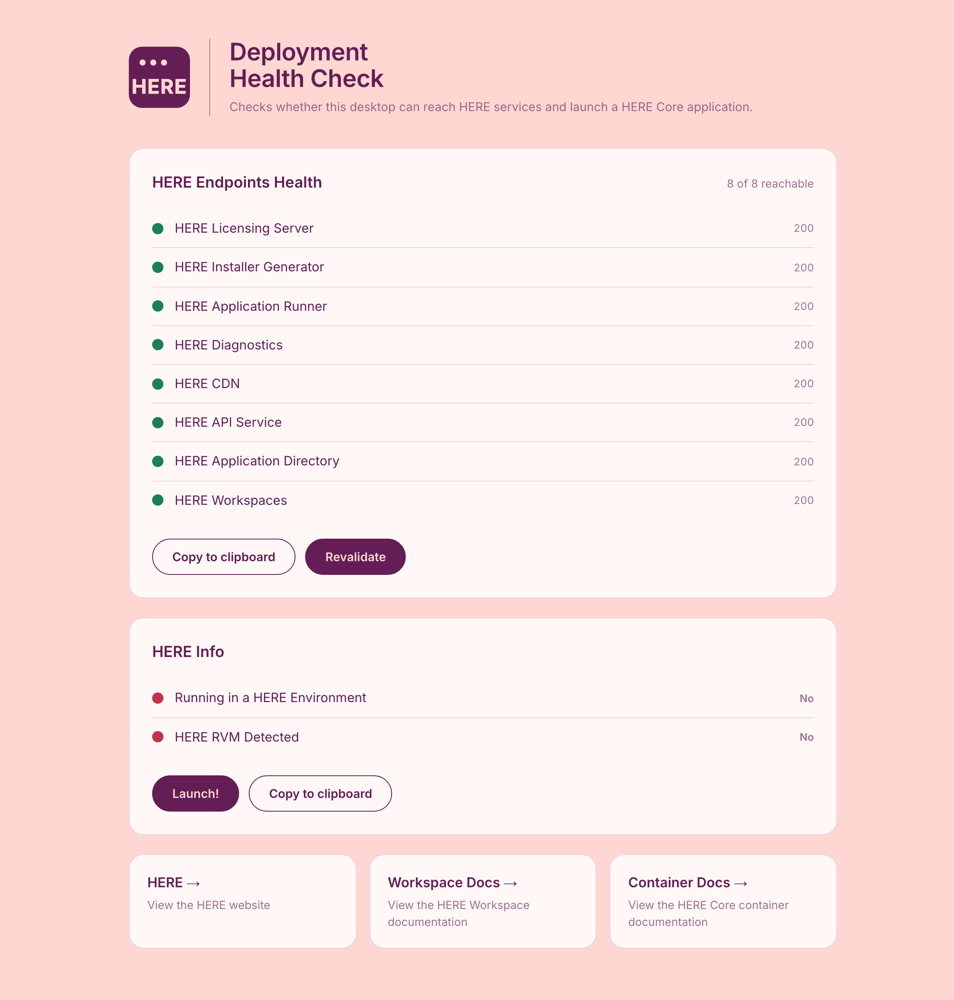

> **_:information_source: HERE:_** [HERE](https://www.here.io/) libraries are a commercial product and this repo is for evaluation purposes. Use of the OpenFin npm packages is only granted pursuant to a license from OpenFin. Please [**contact us**](https://www.here.io/contact/) if you would like to request a developer evaluation key or to discuss a production license.

# HERE Service Deployment Health Check

A sample page that shows the health of the webservices deployed at HERE, using the [@openfin/deployment](https://www.npmjs.com/package/@openfin/deployment) package.

[Live Launch Example](https://cdn.openfin.co/health/check/index.html)



## What the page reports

- **HERE Endpoints Health**: the result of `checkEndpoints()` for each HERE endpoint, with the returned status code. **Copy to clipboard** copies the raw results as JSON, which is useful when raising a support ticket, and **Revalidate** runs the checks again.
- **HERE Info**: whether the page is running in a HERE environment (`fin` is available). Inside a container that label includes the runtime from `fin.System.getVersion()` and the RVM from `fin.System.getRvmInfo()`, for example `Running in a HERE Environment [Runtime: 43.142.102.2, RVM: 12.0.0.0]`. The RVM row and **Launch!** are hidden, because the health check is already running. In a browser, the RVM is detected via `checkForFinsProtocol()`, **Launch!** opens [public/deployment.fin.json](./public/deployment.fin.json) from the current host over the `fin` or `fins` protocol, and **Copy to clipboard** copies that link. `eb` and `eb-instance` are appended as OpenFin `$$` query parameters so the container can read them from `fin.Application.getCurrent().getInfo()`.
- **HERE Runtime**: only shown when the page is running inside HERE and an `eb-instance` manifest was reachable. The runtime version pinned in that manifest is read from `runtime.version`. On Windows, **Download Runtime From CDN** calls [`fin.System.downloadRuntime`](https://cdn.openfin.co/docs/javascript/stable-v26/tutorial-System.downloadRuntime.html) for it, reporting progress and then whether the download succeeded. That API is not available on macOS, so the download control is hidden there. `downloadRuntime` only accepts an exact version such as `41.134.104.4`, so a manifest that pins a release channel like `stable` is reported as such and the button stays disabled.

CORS needs to be enabled for any endpoint in order for the health check to work properly. An endpoint that responds but does not allow this origin is reported as `CORS blocked`, which is distinct from an endpoint that could not be reached at all. RVM detection also needs `enableInstallationDetection` in [desktop owner settings](https://developers.openfin.co/of-docs/docs/how-to-detect-openfin-in-your-app#enable-in-desktop-owner-settings) for RVM v11 and earlier.

## Query parameters

Both parameters are optional, and with neither of them the page checks all eight default HERE endpoints.

| Parameter     | Example                                              | Effect                                                                                                                                                                                                         |
| ------------- | ---------------------------------------------------- | -------------------------------------------------------------------------------------------------------------------------------------------------------------------------------------------------------------- |
| `eb`          | `?eb=true`                                           | Treats this as an Enterprise Browser deployment, which excludes the Installer Generator, Application Runner and Application Directory endpoints because it does not use the RVM based install and launch flow. |
| `eb-instance` | `?eb=true&eb-instance=https://path/to/manifest.json` | When `eb=true`, also checks that the given instance URL can be reached. The label shows only the host. Ignored unless `eb=true`.                                                                               |

The instance must include the path to check. It can be given as `yourpath/path/to/manifest.json` or `https://yourpath/path/to/manifest.json`. A value that is not a URL with a path is ignored. `?eb=true&eb-instance=yourpath/path/to/manifest.json` checks the five remaining default endpoints plus that URL. Without `eb=true`, `eb-instance` does not add an entry.

When the page is launched inside a container, the same keys are read from `userAppConfigArgs` on `fin.Application.getCurrent().getInfo()`, which is where OpenFin puts `$$` deeplink parameters. Those values overlay the browser query string, so `fin://localhost:6060/deployment.fin.json?$$eb=true&$$eb-instance=yourpath/path/to/manifest.json` behaves the same as opening the page with those query parameters.

The manifest `startup_app.url` is `http://localhost:6060/index.html` for local development. Change that URL when you deploy the page to another host.

`eb` also changes what the page points at, because the same endpoint and documentation serve different products in each deployment.

| Shown                     | Standard deployment                                             | `eb=true`                                                                            |
| ------------------------- | --------------------------------------------------------------- | ------------------------------------------------------------------------------------ |
| Workspaces endpoint label | HERE CORE UI                                                    | HERE Notification Center                                                             |
| First documentation link  | [HERE Core UI Docs](https://resources.here.io/docs/core/hc-ui/) | [HERE Enterprise Browser User Docs](https://resources.here.io/docs/guide/users/)     |
| Second documentation link | [HERE Core Docs](https://resources.here.io/docs/core/develop/)  | [HERE Enterprise Browser Developer Docs](https://resources.here.io/docs/guide/devs/) |

## Getting Started

1. Install dependencies. Note that these examples assume you are in the sub-directory for the example.

```shell
npm install
```

2. Build the example.

```shell
npm run build
```

3. Start the test server in a new window.

```shell
npm run start
```

4. Launch the sample in your default desktop browser (or copy <http://localhost:6060/index.html> into your Desktop Browser).

```shell
npm run client
```

## How things are structured

Authored source lives outside of the web root and is bundled into it, so everything served is a real file on disk.

- [client/src/index.ts](./client/src/index.ts): the example for the [@openfin/deployment](https://www.npmjs.com/package/@openfin/deployment) package, importing `checkEndpoints` and `checkForFinsProtocol` as ES module named imports. [client/webpack.config.js](./client/webpack.config.js) bundles it to `public/js/index.bundle.js`, which is generated and not committed.
- [public/index.html](./public/index.html): the page, which loads that bundle. This is the page hosted at the live launch link above.
- [public/deployment.fin.json](./public/deployment.fin.json): a `startup_app` manifest whose `url` is `http://localhost:6060/index.html`. Update that URL when deploying. Launch builds `fin://` or `fins://` from the current page URL and passes `eb` / `eb-instance` as `$$` query parameters.
- [public/common/style/app.css](./public/common/style/app.css): the HERE styling for the page.

## License

The code in this repository is covered by the included license.

However, if you run this code, it may call on the HERE RVM or HERE Runtime, which are covered by HERE's Developers, and Enterprise licenses. You can learn more about HERE licensing at the links listed below or just email us at <support@here.io> with questions.

## Support

Please enter an issue in the repo for any questions or problems. Alternatively, please contact us at <support@here.io>
